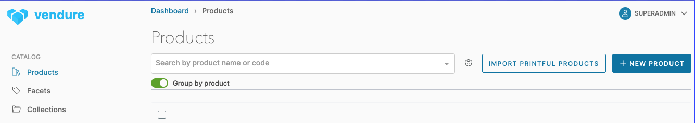

## Printful Vendure Plugin


Import Printful products and start selling!


# Getting started

Install with `yarn add @callit-today/vendure-plugin-printful` and add to plugins in `vendure-config.ts`
```
AdminUiPlugin.init({
    route: 'admin',
    port: 3002,
    app: compileUiExtensions({
        outputPath: path.join(__dirname, '../admin-ui'),
        extensions: [PrintfulPlugin.uiExtensions],
        devMode: IS_DEV,
    }),
}),
PrintfulPlugin.init({ enabled: true }),
```

\
&nbsp;
Add your `PRINTFUL_AUTH_TOKEN` to `.env` and import Printful products in admin UI


\
&nbsp;

## How it works

The plugin uses `FastImporterSerivce` to import products from Printful. Remember to rebuild search index after import completes. When an order is completed, a draft order is created in Printful. 

&nbsp;

## Next steps

Confirm the order in Printful for fulfillment.

&nbsp;

## Todo

Add config option for auto confirming orders on Printful.

\
&nbsp;

## License

MIT
